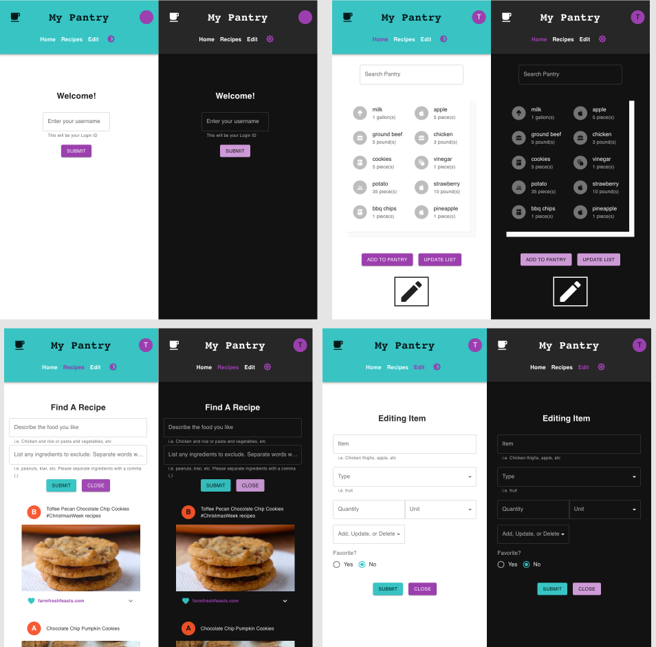

<a name="readme-top"></a>

<!-- TABLE OF CONTENTS -->
<details>
  <summary>Table of Contents</summary>
  <ol>
    <li>
      <a href="#about-the-project">About The Project</a>
      <ul>
        <li><a href="#dependencies">Dependencies</a></li>
        <li><a href="#project-structure">Project Structure</a></li>
      </ul>
    </li>
    <li>
      <a href="#getting-started">Getting Started</a>
      <ul>
        <li><a href="#prerequisites">Prerequisites</a></li>
      </ul>
    </li>
    <li><a href="#recap">Recap</a></li>
  </ol>
</details>
<br/>


<!-- ABOUT THE PROJECT -->
## About The Project

As of 2023, the <cite>[US Bureau of Labor Statistics][1]</cite> data shows the annual inflation is currently more than double the average prior to 2021.  <cite>[Forberg 2022][2]</cite> points out that one-third of the food that families buy every year makes it way into the garbage.  Now is not the time to be wasting food with the uncertainties of the job market and rising food prices.  

Have you found yourself accidentally buying extra perishables and now forcing you to overcook.  Are you generally using a note app on your phone to track your grocery list?  Need something that can do a little more like help track when a favorite pantry item is getting low.  My Pantry is convenient as your notepad that just does a little more.  That "little more" will help reduce your food waste and save you money at the grocery.  With an easy to use interface, you can track your favorite pantry items and recipes all in one site - no app downloads necessary.

<br/>


<br/>

### Dependencies

* React
* React Router Dom
* Firebase
* Formik
* Material UI
* React DND
* API for Recipes (www.edamam.com)

<br/>

### Project Structure
```
└── src
    ├── App.css
    ├── App.jsx
    ├── App.test.js
    ├── __test__
    │   ├── FormInputPage.test.js
    │   ├── LoginPage.test.js
    │   ├── MyPantryBar.test.js
    │   ├── NavLinks.test.js
    │   ├── PantryPage.test.js
    │   └── RecipesPage.test.js
    ├── components
    │   ├── FadeCard.jsx
    │   ├── RecipeCard.jsx
    │   ├── RecipeForm.jsx
    │   ├── RootLayout.jsx
    │   └── SearchBar.jsx
    ├── css
    │   ├── ErrorPage.module.css
    │   ├── FadeCard.module.css
    │   ├── FormInputPage.module.css
    │   ├── ListItemCard.module.css
    │   ├── LoginPage.module.css
    │   ├── MyPantryBar.module.css
    │   ├── NavLinks.module.css
    │   ├── PantryPage.module.css
    │   ├── RecipeCard.module.css
    │   ├── RecipesPage.module.css
    │   └── RootLayout.module.css
    ├── firebase.js
    ├── index.css
    ├── index.js
    ├── logo.svg
    ├── pages
    │   ├── ErrorPage.jsx
    │   ├── FormInputPage.jsx
    │   ├── LoginPage.jsx
    │   ├── PantryPage.jsx
    │   └── ReceipesPage.jsx
    ├── reportWebVitals.js
    ├── script
    │   ├── CorsRequest.js
    │   └── loadDb.js
    ├── setupTests.js
    ├── store
    │   ├── ColorModeContext.jsx
    │   ├── UserContext.jsx
    │   ├── UserProvider.jsx
    │   ├── ex.json
    │   ├── foods.json
    │   ├── myFunctions.js
    │   ├── respExample.json
    │   └── units.json
    └── ui
        ├── ListCard
        │   ├── FoodTypeIcons.jsx
        │   └── ListItemCard.jsx
        ├── MyPantryBar
        │   ├── MyPantryBar.jsx
        │   └── MyPantryMenu.jsx
        └── NavLinks.jsx
```

<br>

<!-- GETTING STARTED -->
## Getting Started

npm install --legacy-peer-deps && npm start.


### Prerequisites
Web browser and code editor.

<br/>

<!-- Recap -->
## Recap

This project was created for a Frontend course during the Full-Stack Development certificate program at [University of Washington - PCE](https://www.pce.uw.edu/). The intended requirements for the project was to build with the React library. This project started from the prior course [(view project here)](https://github.com/csalvador58/uw-jscript310b-final-project-my-pantry).  My continued plan for this project is to improve on the design as I continue through my Full-Stack program. This project is currently being upgraded [(view here for updates)](https://github.com/csalvador58/project-mypantry).

Some highlights in this project:
- Designed with a mobile first approach
- Included uses of React reusable components, Context, Routing
- Touch, drag and drop friendly using React DND
- Designed with Material-UI
- Integration with a Food Recipe API

My thoughts for improvement include:
- Improve UX/UI by design reducing manual typing as much as possible
- Include a backend and DB
- Resolve CORs issue with Food Recipe API when deployed on Firebase

<br/>

<p align="right">(<a href="#readme-top">back to top</a>)</p>